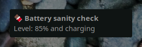

<!DOCTYPE html>
<html lang="en">
  <head>
    <meta charset="UTF-8">
  </head>
<body>
<p align="center">

</p>

<h1>Bash scripts 🐧</h1>
<p>Welcome, this is a collection of scripts to add functionality to a minimal Linux system. I use a small 14" laptop and running a bar just takes too much space of my screen real state so I ditched it, however I missed info such as</p>
<ul>
  <li>Available RAM</li>
  <li>Date and time</li>
  <li>CPU temps</li>
  <li>Battery level and status</li>
</ul>
<p>wanting to solve this I made a couple of scripts to extract the info needed and see it through dunst. Hope every script name if self explainatory but there are two classes of scripts in here: ones you need to execute every time for they to work, and ones you need to autostart. In the latter part there are just two, these being battery_notification.sh, mem_alert.sh and autostart.sh so for this to work you need to autostart them, see the installation section.</p>
<p>With this out of the way, hope the scripts are useful and please feel free and modify it to your needs.</p>
<p>Dependencies</p> 
<ul>
  <li>Dunst</li>
  <li>Noto fonts emoji</li>
</ul>

<p style=strong><b>Notification previews 👀</b></p>
<p align="center">
  
  <p align="center">🔌 Current battery status and charge</p>
</p>
<p align="center">
  
  <p align="center">🔋 Full battery</p>
</p>
<p align="center">
  
  <p align="center">🏖️ Current memory available</p>
</p>
<p align="center">
  
  <p align="center">🏄‍♀️ Low memory alert</p>
</p>

<b>Installation 🖥️</b>
```
# Clone the repo
git clone https://github.com/celepharn/bash-scripts.git ~/.config/bash-scripts
# Make every script executable
find ~/.config/bash-scripts -type f -name '*.sh' -exec chmod +x {} \;
# Installing dependencies, I use Arch BTW
sudo pacman -S noto-fonts-emoji dunst
```
<p>And finally configure them using your WM/DE of choice. For example, for <a href='https://github.com/hyprwm/Hyprland/'>Hyprland</a> we would have</p>

```
# For now scripts
bind=SUPERCTRL,R,exec,~/.config/hypr/nameOfScript.sh
# For autostart scripts
exec-once=~/.config/hypr/battery_notification.sh
```
<p>in your ~/.config/hypr/hyprland.conf.</p>
<p>Please remember to change the actual name of the script you would want to use.</p>

<b>A final note 🗒️</b>
<p>The script that needs a comment is update.sh, this is a script to automate the process of keeping <a href='https://www.rodsbooks.com/refind/'>rEFInd</a> working every time there's a kernel update, and would need modification to suit your system. Just if you are a <a href='https://www.rodsbooks.com/refind/'>rEFInd</a> user and would want to use this.</p>
</body>
