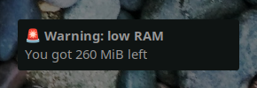

# Bash scripts 🐧

Welcome, feel free to use this and modify it to your needs.

Dependencies
 
<ul>
  <li>Dunst</li>
  <li>Noto fonts emoji</li>
</ul>

## Theme previews 👀

  
  
🔌 Current battery status and charge

  
  
🔋 Full battery

  
  
🏖️ Current memory available

  
  
🏄‍♀️ Low memory alert

